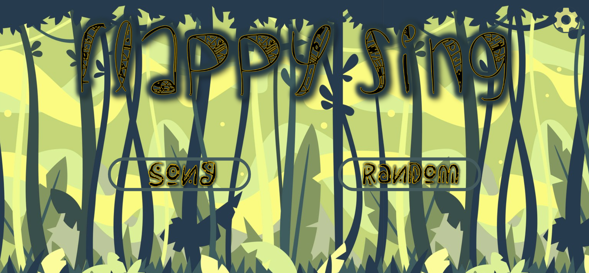
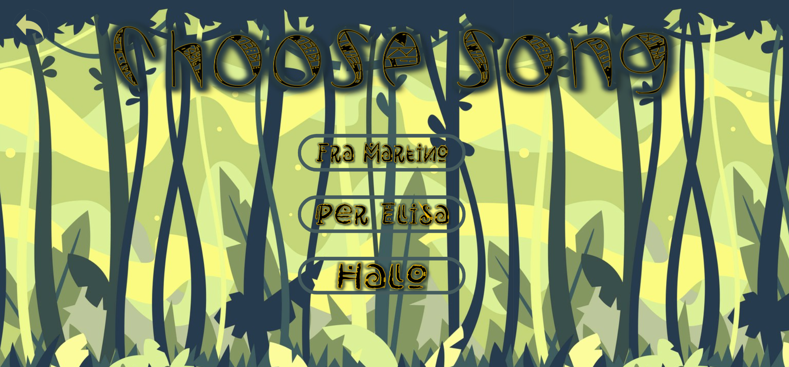
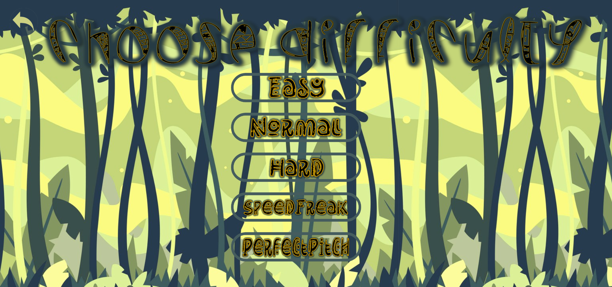

# Flappy Sing

Are you a very bad singer, like us ? 
Do you want to improve your singing while having fun ?

Flappy Sing is here for you: a didactic game in which you have to play with your voice. 
Guide the cicada thorugh the obstacles and experiment with different levels of difficulty and more. 

What you need to play Flappy Sing is a microphone (even the built-in mic of your PC is good). 
Of course you'll need to use your voice, so make sure you have one. 

# HOW TO PLAY

The cicada will follow your voice guidance, the more in tune you are the smoothest the cicada will pass the obstacle. 
The notes that you need to sing are shown on the screen. 
Make sure you start singing before the obstacle reaches the cicada, since it doesn't move immediately. 

# GAME MODES 

You can choose between two different modes: Song and Random. 

when in Song mode you can choose from different existing songs and sing along. 

In Random mode you'll have different choices, choose beetween: Easy, Normal, Hard, Speed freak and Perfect pitch. 

The Random mode isn't completely randomic: you'll have to face a different set of musical intervals depending on the difficulty. 

Easy, Normal and Hard are pretty self explanatory: you'll have more and more intervals, less time and you'll have to be more precise as the level goes up. 

Speed freak and Perfect pitch are variations of the Hard Mode. 
In Speed freak the obstacles will go very fast, so you'll have less time to be in tune. 
Perfect pitch is a mode that not every human can approach, as you can imagine you'll have to be in PERFECT TUNE. This mode is not forgiving. 

Here's a list of the set of intervals. 
Easy Mode: unison, maj/min 2nd and 3rd, perfect 4th and 5th, octave. 
Normal Mode: unison, maj/min 2nd and 3rd, perfect 4th and 5th, octave, maj 6th and 7th.
Hard Mode:  unison, maj/min 2nd and 3rd, perfect 4th and 5th, octave, maj/min 6th and 7th, tritone.

# OPTIONS

Here are two additional options in case you want to modify your gaming experience.
Guided Start plays a pure tone at the beginning of the song in order to have a reference pitch. This option is selected by default.
Disable Collision simply unables the obstacle collision, letting you play nonstop. This feature was mainly used for debugging purpose but it was left there in case the user wants to just keep playing without retrying.

# HOW DOES IT WORK
The signal coming from your microphone [...] -> filtering -> analysis
Note on top left, always active.

# PITCH DETECTION
Let's have a look at the insigth of the pitch detection algorithm. First, the input signal is stored in a buffer and an STFT is performed. Then, for each STFT window, the maximum peak of the spectrum is detected using a parabolic interpolator which fits a parabola through the highest three samples of a peak to estimate the true peak location and height. Finally, before outputing the detected frequency, a consistency check is performed, meaning that the values of peaks that are close in time must be similar, otherwise the detection is invalid. Inside the whole STFT operation, zero-padding will increase the accuracy of the simple peak detection. The method use for estimating peak frequency is a cross-correlation between the whole STFT window transform and the entire spectrum, taking an interpolated peak location in the cross-correlation function as the frequency estimate.

 

